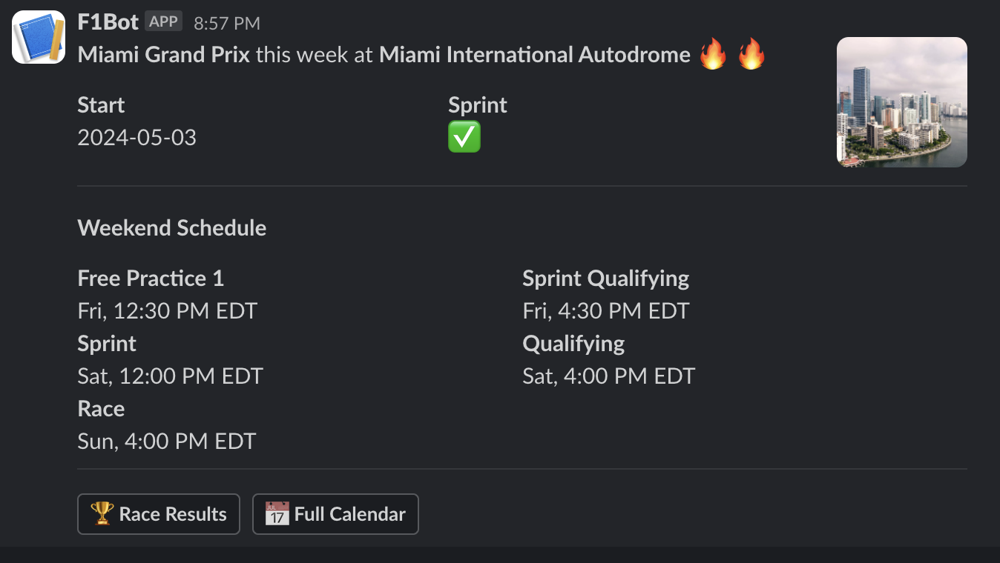

# f1-slack-stack

A scheduled lambda that posts next F1 race information into a configured Slack channel.



## Deploy

This application uses AWS SAM to package, build and deploy this application. Once you have the sam CLI installed, run:

```bash
sam build
sam deploy
```

### Configuring Slack

In order to post to slack, you will need to create a Slack application. A basic shell of an app will work just fine.

Once you have that, you can simply create a webhook under the `Incoming Webhooks` tab. The URL that it gives you is the url that you will need to configure in the SAM template.

To add the environment variable, go to the `template.yml` in the root of the directory, and update the `SLACK_WEBHOOK_URL` to the url generated above.

**Other Environment Variables**

- `DISPLAY_TZ` - this is the timezone that the data is formatted for (default: `America/New York`)

### Pulling Fresh Data

There is a little script that you can use to pull a fresh version of the event data that is used in the lambda every week. To execute, simply run:

```bash
npm run pull-data
```

This will show you a diff of the latest file and the committed one. Ensure that you want the changes before accepting.

## Testing

Build your application by using the `sam build` command.

```bash
sam build
```

The AWS SAM CLI installs dependencies that are defined in `package.json`, creates a deployment package, and saves it in the `.aws-sam/build` folder.

To run the local function:

```bash
sam local invoke F1RacePoster --event events/event-cloudwatch-event.json
```

### Unit tests

Tests are defined in the `__tests__` folder in this project. Use `npm` to install the [Jest test framework](https://jestjs.io/) and run unit tests.

```bash
npm install
npm run test
```

## Fetch, tail, and filter Lambda function logs

To simplify troubleshooting, the AWS SAM CLI has a command called `sam logs`. `sam logs` lets you fetch logs that are generated by your Lambda function from the command line. In addition to printing the logs on the terminal, this command has several nifty features to help you quickly find the bug.

**NOTE:** This command works for all Lambda functions, not just the ones you deploy using AWS SAM.

```bash
sam logs -n F1RacePoster --stack-name sam-app --tail
```

**NOTE:** This uses the logical name of the function within the stack. This is the correct name to use when searching logs inside an AWS Lambda function within a CloudFormation stack, even if the deployed function name varies due to CloudFormation's unique resource name generation.

You can find more information and examples about filtering Lambda function logs in the [AWS SAM CLI documentation](https://docs.aws.amazon.com/serverless-application-model/latest/developerguide/serverless-sam-cli-logging.html).

## Cleanup

To delete the sample application that you created, use the AWS CLI. Assuming you used your project name for the stack name, you can run the following:

```bash
sam delete --stack-name f1-slack-stack
```

## Resources

For an introduction to the AWS SAM specification, the AWS SAM CLI, and serverless application concepts, see the [AWS SAM Developer Guide](https://docs.aws.amazon.com/serverless-application-model/latest/developerguide/what-is-sam.html).

Next, you can use the AWS Serverless Application Repository to deploy ready-to-use apps that go beyond Hello World samples and learn how authors developed their applications. For more information, see the [AWS Serverless Application Repository main page](https://aws.amazon.com/serverless/serverlessrepo/) and the [AWS Serverless Application Repository Developer Guide](https://docs.aws.amazon.com/serverlessrepo/latest/devguide/what-is-serverlessrepo.html).
